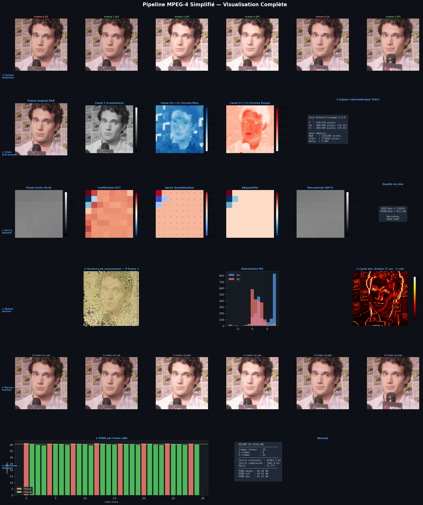

# Pipeline d'Encodage Vidéo MPEG-4 Simplifié 

## Projet de Systèmes Multimédias — USTHB  
### M1 IL — Année Universitaire 2025/2026

---

- **Benaissa Manel** 
- **Mezian Fatima** 

Département Informatique — USTHB

---

# Description du Projet

Ce projet implémente un pipeline complet d'encodage vidéo inspiré du standard **MPEG-4**, entièrement développé en **Python**.

L’objectif principal est de comprendre les mécanismes fondamentaux de la compression vidéo moderne en implémentant manuellement les différentes étapes du pipeline sans utiliser de bibliothèques de compression vidéo avancées.

Le système traite une séquence de frames extraites d’une vidéo et applique plusieurs techniques de compression :

- Conversion colorimétrique RGB → YCbCr
- Sous-échantillonnage chrominance 4:2:0
- Codage intra-frame (I-frames)
- Codage inter-frame (P-frames)
- Estimation et compensation de mouvement
- Compression entropique RLE + Huffman
- Reconstruction vidéo
- Évaluation de qualité par PSNR

---

# Technologies Utilisées

| Technologie | Rôle |
|---|---|
| Python 3 | Langage principal |
| NumPy | Calcul numérique |
| SciPy | Transformée DCT |
| Matplotlib | Visualisation |
| Pillow (PIL) | Traitement d’images |

---


# Pipeline MPEG-4 Simplifié

Le pipeline suit cinq grandes étapes inspirées du standard MPEG-4.

---

# Pré-traitement

Chaque frame RGB est convertie vers l’espace colorimétrique **YCbCr** selon la norme **ITU-R BT.601**.

Ensuite, un sous-échantillonnage **4:2:0** est appliqué aux canaux chrominance.

## Opérations réalisées

- Conversion RGB → YCbCr
- Sous-échantillonnage 4:2:0
- Reconstruction chrominance

## Objectif

Réduire la quantité de données couleur tout en conservant une bonne qualité visuelle.

---

# Codage Intra-frame (I-frames)

Les I-frames sont compressées indépendamment selon une approche similaire au standard JPEG.

## Étapes

- Découpage en blocs 8×8
- Application de la DCT 2D
- Quantification JPEG
- Stockage des coefficients compressés

## Objectif

Réduire la redondance spatiale à l’intérieur d’une image.

---

# Codage Inter-frame (P-frames)

Les P-frames exploitent la redondance temporelle entre images consécutives.

## Estimation de mouvement

L’image est divisée en macroblocs 16×16.

Pour chaque bloc :
- Recherche du meilleur bloc dans l’image de référence
- Calcul des vecteurs de mouvement
- Génération du résidu

## Compression du résidu

Le résidu est ensuite compressé par :
- DCT
- Quantification

---

# Codage Entropique

Après quantification, les coefficients DCT contiennent de nombreux zéros.

Deux méthodes de compression sans perte sont appliquées.

## RLE (Run-Length Encoding)

Compresse les répétitions de symboles.

## Huffman

Attribue des codes binaires courts aux symboles fréquents.

---

# Reconstruction & Évaluation

Le système reconstruit les frames compressées puis calcule les métriques de qualité.

## Métriques calculées

- PSNR (Peak Signal-to-Noise Ratio)
- Ratio de compression
- Analyse des résidus
- Distribution des vecteurs de mouvement

---

# Format du Fichier Binaire

Le pipeline génère un fichier compressé :

```text
video.bin
```
---

# Visualisation du Pipeline

Le projet génère une visualisation complète du pipeline MPEG-4.

La figure contient :

- Frames originales
- Canaux Y, Cb, Cr
- Sous-échantillonnage
- Coefficients DCT
- Quantification
- Vecteurs de mouvement
- Histogramme des mouvements
- Cartes des résidus
- Frames reconstruites
- Analyse PSNR
- Résumé statistique

---

# Visualisation Complète




# Exécution du Projet


## Extraire les frames

```bash
python extract_frames.py
```

---

## Lancer le pipeline

```bash
python main.py
```

---

# Options Disponibles

## Modifier le GOP

```bash
python main.py --gop 6
```

## Modifier le facteur de qualité

```bash
python main.py --qf 1.5
```

## Utiliser un dossier personnalisé

```bash
python main.py --frames_dir frames
```

## Lancer l’analyse expérimentale

```bash
python main.py --analysis
```


